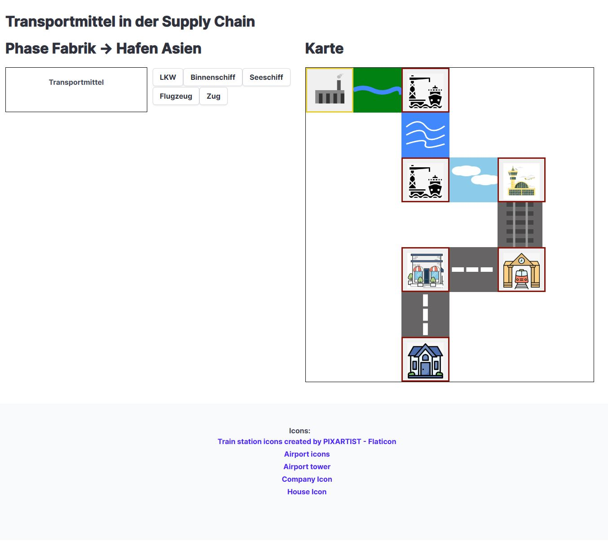
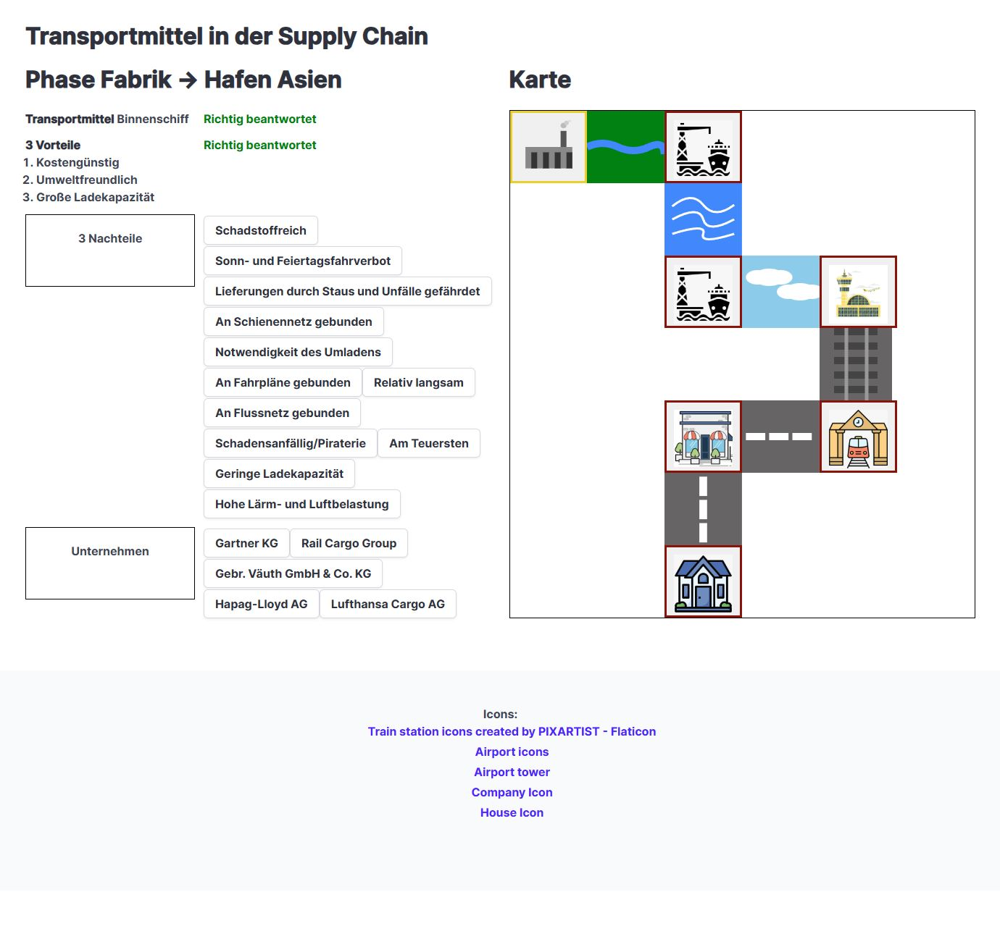
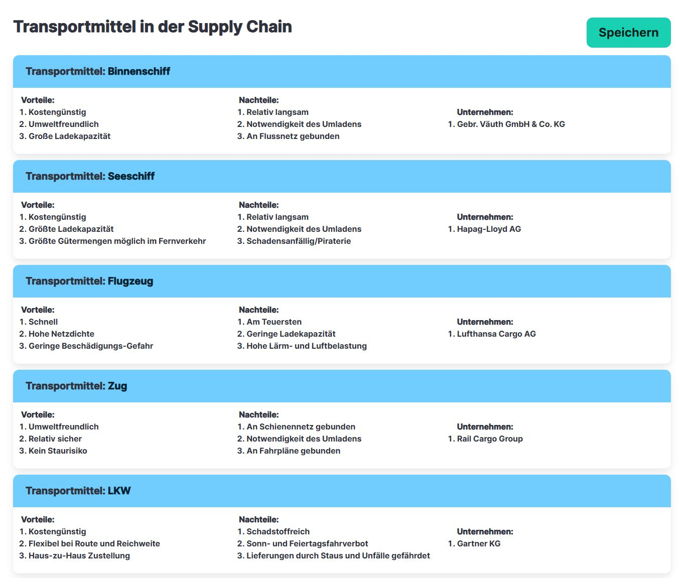

# Supply Chain Quiz

Prototype on a quiz game where the player needs to drag in the right elements in order finish the quiz. This should
showcase an idea for learning game where the students would in combination with map and questions go through
the quiz. At the end of the quiz a user would get a summary of the content which is easy printable and can be later used
for studying.

Currently it is not possible to dynamically set the game state but its hardcoded in the gamestate.js file. States 
could be changed there.

### Project state
Note there are no automatic tests and no linting or whatsoever. This was just a basic prototype probably a lot of
best practices are not followed by any mean.

Further ideas to go on would be make the state more flexible with providing an config object from the outside. Maybe
with a server component to store it. Furthermore the gird must be changed to be configured by the gamestate rather
than being hardcoded.

### Technologies used
The main framework used is `react`. This builds the states and the interaction. For css I have used `bulma` as it 
offers a easy to use set of classes and it also has a neat `grid` option which is used for the map.

The dragging was build with `dndkit`. It can be used also via mobile but would need further optimizations to make it more smooth.

## Screenshots

### Initial State

### Step during the quiz

### Summary

## Development

The project was created with [Create React App](https://github.com/facebook/create-react-app) and the `package.json`
structure was not changed further.

### `npm start`

Runs the app in the development mode.\
Open [http://localhost:3000](http://localhost:3000) to view it in your browser.

### `npm run build`

Builds the app for production to the `build` folder.\
It correctly bundles React in production mode and optimizes the build for the best performance.

The build is minified and the filenames include the hashes.\
Your app is ready to be deployed!

